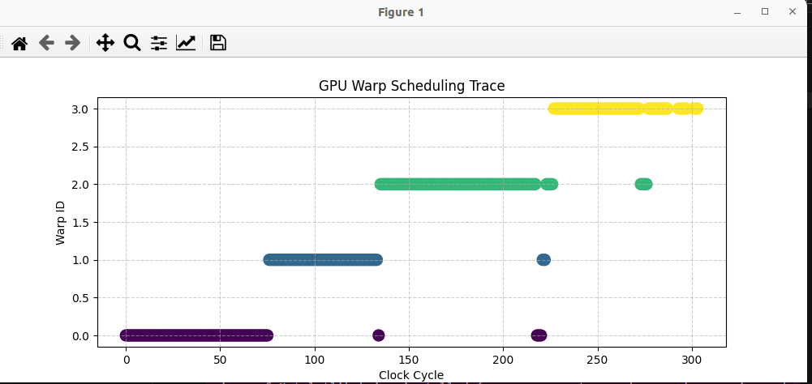
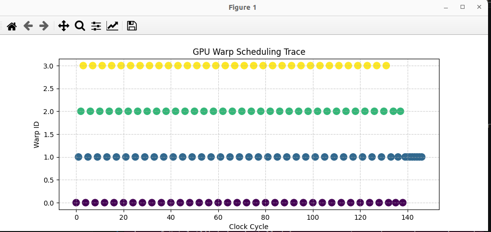

# GPU Warp Scheduler Simulator

A GPU warp scheduler simulator built in C++ that models how a Streaming Multiprocessor (SM) executes warps across clock cycles. Implements and compares two scheduling policies: **Round Robin** and **Greedy-Then-Oldest (GTO)** — with per-cycle execution tracing.The scheduling policy that governs which warp runs next has a direct impact on:

- **Latency hiding efficiency**: how well the scheduler masks stall cycles
- **IPC (Instructions Per Cycle)**: overall throughput
- **Warp utilization**: how evenly compute resources are used
- **Fairness**: whether all warps make progress or some starve

---

## Architecture

```
GPU_Wrap_Scheduler_Simulator/
│
├── core/
│   ├── thread.cpp       # tracks remaining instructions and blocked state
│   └── warp.cpp         # contains 32 threads, program counter, completion check
│
├── scheduler/
│   ├── round_robin.cpp  
│   └── gto.cpp          
│
├── main.cpp             
├── viz.py               # plots warp scheduling trace
└── viz_data.csv         # Output: per cycle log of scheduled warp and instruction count
```

---

## How to Build and Run

### Build

```bash
g++ -o scheduler_sim main.cpp
```

### Run Simulation

```bash
./scheduler_sim
# Output: viz_data.csv
```

### Visualize

```bash
python3 viz.py
```

---

## Core Components

### Thread

Each thread tracks:

```cpp
struct Thread {
    int id;
    int remaining_instructions;
    bool is_blocked = false;
    int stall_countdown = 0;
    int branch_path = 0;
    bool active_mask = true;
};
```

A thread is complete when `remaining_instructions <= 0`.

---

### Warp

A warp is a group of **32 threads** that execute together in SIMT way. This mirrors real GPU hardware where one instruction is issued per warp, executing across all 32 threads simultaneously.

```cpp
struct Warp {
    int id;
    std::vector<Thread> threads;  // always 32 threads
    int pc = 0;                   // Program Counter

    bool diverged= false;
    int diverge_pass=0;
};
```

---

### SM (Streaming Multiprocessor)

The SM is the GPU's core execution unit. It holds all active warps and tracks clock cycles.

```cpp
class SM {
public:
    int id;
    std::vector<Warp> active_warps;
    int clock_cycles = 0;

    void load_warps(int count, int inst_per_thread) {
        for (int i = 0; i < count; ++i) {
            Warp w; w.id = i;
            for (int j = 0; j < 32; ++j)
                w.threads.push_back({j, inst_per_thread});
            active_warps.push_back(w);
        }
    }
};
```

`load_warps(count, inst_per_thread)` initializes `count` warps, each with 32 threads carrying `inst_per_thread` instructions. In the current simulation: **4 warps × 32 threads × 10 instructions = 1,280 total thread-instructions**.

---

## Scheduling Policies

### Round Robin 

Cycles through all active warps in order. Each cycle, it picks the next non-completed warp after the last scheduled one.

```cpp
class RoundRobinScheduler {
    int current_warp_idx = 0;
public:
    Warp* schedule(SM& sm) {
        for (size_t i = 0; i < sm.active_warps.size(); ++i) {
            int idx = (current_warp_idx + i) % sm.active_warps.size();
            if (!sm.active_warps[idx].is_done()) {
                current_warp_idx = (idx + 1) % sm.active_warps.size();
                return &sm.active_warps[idx];
            }
        }
        return nullptr;
    }
};
```

**Behavior:** 

- Switches away from stalled warps
- Distributes execution evenly across all warps.
- No single warp gets priority.
- Each warp makes incremental progress every few cycles.

**Tradeoff:**  

- High fairness, but increased context-switching. 
- Individual warp completion is slower since execution is spread evenly.

---

### Greedy-Then-Oldest (GTO)

Always returns the first non-completed warp effectively the oldest active warp.

```cpp
class GTOScheduler {
public:
    Warp* schedule(SM& sm) {
        for (auto& warp : sm.active_warps) {
            if (!warp.is_done()) return &warp;
        }
        return nullptr;
    }
};
```

**Behavior:** 
- Aggressively executes one warp to completion before moving to the next. 
- Minimizes context switching overhead.
- Switches only when: Warp stalls or completes

**Tradeoff:**
- Fast individual warp completion, but later warps are starved until earlier ones finish.
- Under memory stalls, GTO can idle the SM entirely if the chosen warp is blocked.

---

## Stall and Warp Divergence Simulation

- Each executing thread has a probability of becoming blocked: 30%, in 5 to 15 clock cyles. This simulates memory latency, cache misses, long latency operations.
- Each warp has a probability of diverging during execution: 15%, Warp reconverges after both passes complete.


---

## Clock Cycle 

The clock cycle loop drives the simulation:

```cpp
while (total_inst > 0 && sm.clock_cycles < 2000) {
    Warp* scheduled = scheduler.schedule(sm);
    if (scheduled) {
        for (auto& t : scheduled->threads) {
            if (t.remaining_instructions > 0) t.remaining_instructions--;
        }
        total_inst--;
        log << sm.clock_cycles << "," << scheduled->id << "," << total_inst << "\n";
    }
    sm.clock_cycles++;
}
```

Each cycle:
1. Scheduler selects a warp
2. All 32 threads in that warp decrement their instruction count by 1
3. The cycle, warp ID, and remaining instruction count are logged to `viz_data.csv`
4. Clock advances

The loop terminates when all instructions complete or the cycle cap (500) is hit.

---

## Visualization

Plots the scheduling trace from `viz_gto.csv` and `viz_rr.csv` each point is one clock cycle, showing which warp was scheduled.

---
## Round Robin



---

## Greedy To Oldest 



---

**Round Robin output:** Longer continuous execution bursts, a striped pattern showing even distribution.

**GTO output:** More evenly distributed execution and smoother utilization

---

## Key Observations

| Metric | Round Robin | GTO |
|---|---|---|
| Fairness | High (all warps progress evenly)   | Low (later warps starve)  |
| Individual warp completion | Slower | Faster |
| Context switching | High | Low |
| Latency hiding (with stalls) | Better (can switch away from stalled warp) | Worse (stays on stalled warp) |
| IPC under no stalls | Similar | Similar |


---
